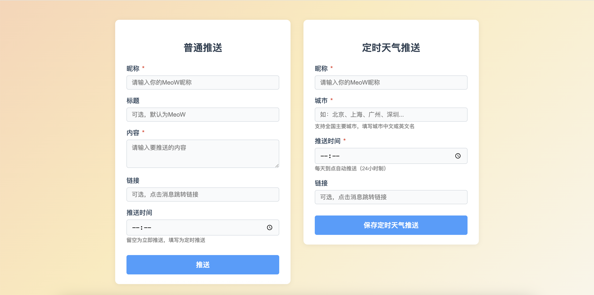

# Push To Meow - 向Meow推送自定义消息

[English](#english) | [简体中文](#chinese)

---
<strong>用户可以👉🏻<a href="http://121.29.19.143:5001">戳这里</a>进行体验，这个项目完全免费，承诺不收取任何使用第三方API的费用！</strong>

## Chinese

### 项目概述

Push To Meow 是一个基于专为 HarmonyOS 5+ 用户设计的智能推送服务Meow的DIY工具。用户需要在手机或平板上从 App Gallery 安装 Meow 软件，才能接收推送到自己设备上的消息。因为这个工具是通过Meow的api接口进行推送的。

### 主要功能

- **即时推送**: 立即向设备发送通知消息
- **定时推送**: 设置每日定时自动推送，支持自定义时间
- **自定义消息**: 支持发送带标题和可选链接的个性化消息

### 使用前提

- HarmonyOS 5.0 或更高版本
- 从 App Gallery 安装 Meow 应用

### 当前支持推送的内容
1. 每日天气预报

【正在加入新的推送内容中...】

### 页面功能说明
页面分为两大板块：

#### 1. 普通推送
- **昵称**（必填）：输入你在MeoW App中的昵称。
- **标题**（可选）：消息标题，默认为MeoW。
- **内容**（必填）：要推送的消息内容。
- **链接**（可选）：点击消息后跳转的链接。
- **推送时间**（可选）：留空为立即推送，填写为定时推送（24小时制）。

#### 2. 定时天气推送
- **昵称**（必填）：输入你在MeoW App中的昵称。
- **城市**（必填）：支持全国大部分城市，填写中文、英文城市名。我在上方也提供了天气API支持查询的城市名称CSV文件，可以查找一下需要预报的城市是否支持，基本上都是支持的。
- **推送时间**（必填）：每天到点自动推送天气（24小时制）。
- **链接**（可选）：点击消息后跳转的链接。

#### 操作流程
1. 填写左侧表单可发送普通消息或定时消息。
2. 填写右侧表单可设置每天定时天气推送。
3. 提交后，消息会推送到你在MeoW App上绑定的设备。

### 天气功能

服务集成了和风天气 API，支持中国城市天气信息推送。天气消息包含：
- 当前温度和天气状况
- 风向和风力等级
- 湿度和能见度
- 每日天气预报
- 日出日落时间

### 注意事项

- 确保设备已正确安装 Meow 应用
- 定时推送功能需要服务持续运行
- 天气信息基于和风天气 API 提供

### 特别鸣谢

鸣谢<a href="http://www.chuckfang.com/Meow">方程</a>以及Meow的各位开发者们！

---

## English

### Overview

Push To Meow is a DIY tool based on the official Meow smart push service for HarmonyOS 5+ users. To receive pushes on your device, you need to install the Meow app from App Gallery on your phone or tablet. This tool sends notifications to your devices via the Meow API interface.

### Features

- **Instant Push**: Send immediate notifications to your devices
- **Scheduled Push**: Set up daily automated notifications at specific times
- **Custom Messages**: Send personalized messages with titles and optional URLs

### Prerequisites

- HarmonyOS 5.0 or higher
- Meow app installed from App Gallery

### Current Supported Push Content
1. Daily weather forecast

[More push content coming soon...]

### Web UI Description

The web page is divided into two main sections:

#### 1. Normal Push
- **Nickname** (required): Enter your MeoW nickname.
- **Title** (optional): Message title, default is MeoW.
- **Content** (required): The message you want to push.
- **Link** (optional): URL to open when the message is clicked.
- **Push Time** (optional): Leave blank for immediate push, or set a time for scheduled push (24-hour format).

#### 2. Scheduled Weather Push
- **Nickname** (required): Enter your MeoW nickname.
- **City** (required): Supports major cities in China, can use Chinese or English city names.I also provided CSV files of city names that the weather API supports querying above, which can be used to check if the cities that need to be forecasted are supported. Basically, they are all supported.
- **Push Time** (required): The time to automatically push weather info every day (24-hour format).
- **Link** (optional): URL to open when the message is clicked.

#### How to Use the Web UI
1. Fill out the left form to send a normal or scheduled message.
2. Fill out the right form to set up daily scheduled weather push.
3. After submitting, the message will be pushed to your device bound in the MeoW App.

### Weather Support

The service supports weather information for Chinese cities using the QWeather API. Weather messages include:
- Current temperature and conditions
- Wind direction and speed
- Humidity and visibility
- Daily forecast
- Sunrise and sunset times

### Notes

- Make sure your device has the Meow app installed
- Scheduled push requires the service to keep running
- Weather information is provided by QWeather API

### Special Thanks

Thanks<a href="http://www.chuckfang.com/Meow">Chuck Fang</a>and all the developers of Meow!

---

## License

MIT License 
